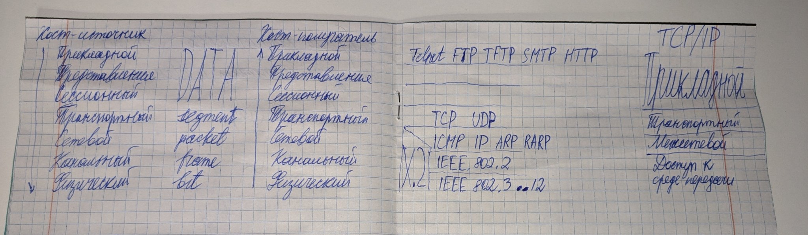

# Протоколы

Набор операций и соглашений, которые регулируют передачу трафика по сети

- Маршрутизируемые (routed)
- Немаршрутизируемые (routing)

Стремление к максимальному упорядочиванию и упрощению процессов разработки называется 

## OSI
Open System Interconnection

Каждый из уровней представляет определенную уровню функций, необходимых для работы компьютерной сети

КОММУНИКАЦИИ - обеспечение точной доставки данных между конечными станциями
- Приложения
- Представления
- Сессионный
- Транспортный

СОЕДИНЕНИЯ - управление физической доставкой данных по сети
- Сетевой - маршрутизаторы, коммутаторы 3-го уровня   -
- Канальный - мосты, коммутаторы                      -  ЭТО ВСЕ МОДЕМЫ
- Физический - кабели, повторители, концентраторы     -

### Уровень приложения

С точки зрения пользователя основным является уровень приложения - он определяется прикладные процессы пользователя
- Прикладные протоколы
- Протоколы передачи файлов
- Виртуального терминала
- Электронной почты

### Уровень представления
- Единый для всех систем синтаксис передаваемой информации

### Уровень сессии
- Отвечает за организацию сеансов связи между прикладными процессами

### Уровень транспортный
- Создаются порты
- Создаются соединения - логические каналы между процессами

### Уровень сети
- Предназначен для маршрутизации информации

### Канальный уровень
- Обеспечивает функциональные и процедурные средства для восстановления, поддержания и расторжения соединения

### Физический уровень
- Обеспечивает механический, электрический и функциональные средства организации физических соединений при передаче бит данных между физическими объектами

## Инкапсуляция в сетях

Термин инкапсуляция данных обозначает вложение информации, созданной по некоторому протоколу секцию данных блока данных другого протокола

5 этапов инкапсуляции на передающем устройстве:
1. Информация пользоваталей преобразуется в данные
2. Из данных состоят сегменты
3. Сегменты преобразуются в пакеты (датаграммы)
4. Пакеты разбиваются на кадры
5. Из кадров составляют поток битов

На физическом уровне осущствляется пересылка данных в виде единиц и нулей, когда достигнет этот поток получателя, то "поднимутся вверх" по уровню OSI
И на каждом уровне будет производиться деинкапсуляция данных соответствующего уровня

## TCP/IP
Стек протоколов разных уровней, используемых в Интернет

### Особенности TCP/IP
- Открытые стандарты протоколов, разрабатываемые независимо от программного и аппаратного обеспечения
- Независимость от физической среды передачи
- Система уникальной адресации
- Стандартизованные протоколы высокого уровня для распространенных пользовательских сервисов

Стек протоколов TCP/IP делится на 4 уровня
- TCP - основа транспортных средств стека TCP/IP
    - 
- IP - протокол межсетевого взаимодействия
    - IP обеспечивает передачу пакетов (датаграм) от отправителя к получателю через объединенную сеть компьютерных сетей
    - И в каждой очередной сети протокол IP вызывает средства транспортировки, принятые в сети

По протоколу IP **нет** подтверждения доставки пакета (нет квитирования)

TCP обеспечивает подтверждение доставки пакета

#### UDP
User Datagram Protocol

Обеспечивает ненадежную доставку пакетов (нет квитирования)

## Соотношение стеков OSI и TCP/IP

|TCP|UDP|-|
|---|---|-|
|stream|message|Application Layer|
|segment|packet|Transport Layer|
|datagram|datagram|Internet Layer|
|frame|frame|Network Access Layer|

Протоколы транспортного уровня обеспечивают сквозную доставку данных между двуми прикладными процессами

Процесс, получающий или отправляющий данные с помощью транспортного уровня, идентифицируется номером, который называется номером порта, т.е. роль адреса отправителя и адрес получателя выполняет номер порта

Основным протоколом межсетевого уровня является IP

Основным способом связи с доступом к среде передачи является отображение IP адреса на MAC-адреса - ARP (т.е. между канальным и сетевым уровнем)

## Telnet
Протокол эмуляции терминала и позволяет рассматривать все удаленные терминалы как стандартные сетевые виртуальные терминалы

## FTP
File Transfer Protocol
Позволяет пользователю просматривать каталог удаленного компьютера и манипулировать файлами на нем

## SMTP
Simple Mail Transfer Protocol

## ARP
Address Resolution Protocol

# Адресация в сетях
Типы адресов
- Физический
    - MAC-адрес
- Сетевой
    - IP-адрес
- Символьный
    - DNS

Локальный адрес узла определяется технологией, с помощью которой построена сеть

Для хостов, входящих в локальные сети, определяющим адресом является MAC-адрес (соединены через коммутатор)

## MAC-адрес
6 байтов (48 бит)
- 3 старших байта - идентификатор фирмы
- 3 младших байта - производитель

Считается, что MAC-адреса не должны повторяться, но в реальной жизни они иногда повторяются.

## IP
IP адрес используется на сетевом уровне, назначается администратором во время конфигурирования маршрутизатора

### Части IP-адреса
По смыслу IP адрес состоит из двух частей (не фиксированно)
- Адрес сети
    - Может быть выбран администратором произвольно, либо через Network Information Center (NIC)
- Адрес узла

Какая часть адреса относится к номеру сети, а какая к номеру узла - определяется значениями первых битов адреса

### Факты об IP
- Номер узла в протоколе IP выбирается независимо от локального адреса узла

Узел может входить в несколько IP-сетей, и будет иметь число IP-адресов по числу сетевых связей

IP-адрес характеризует не отдельный компьютер или маршрутизатор, а одно сетевое соединение

Адресация IP бывает классовая и бесклассовая

### 5 классов IP адресов
Какая часть адреса относится к номеру сети, а какая к номеру узла - определяется значениями первых битов адреса

Деление на классы определяется тем, сколько бит относится к сетевой части, а сколько к номеру узла

#### Класс A
1 байт сеть
3 байта узел

0
сеть.узел.узел.узел

#### B
2 байта сеть
2 байта узел

10
сеть.сеть.узел.узел

#### C 
3 байта сеть
1 байт узел

110
сеть.сеть.сеть.узел

192.

#### D
1110
Особый групповой адрес (multicast)

#### E
11110
Зарезервирован для будущих применений (так пишут в литературе)

## DNS
servi.ibm.com.

Разрешается сначала по `com.`, затем по `ibm.`, затем по `servi.`

СДО МОЖНО НЕ ДЕЛАТЬ!
